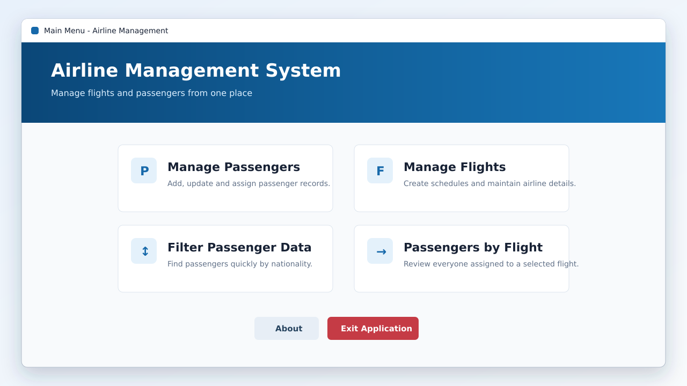
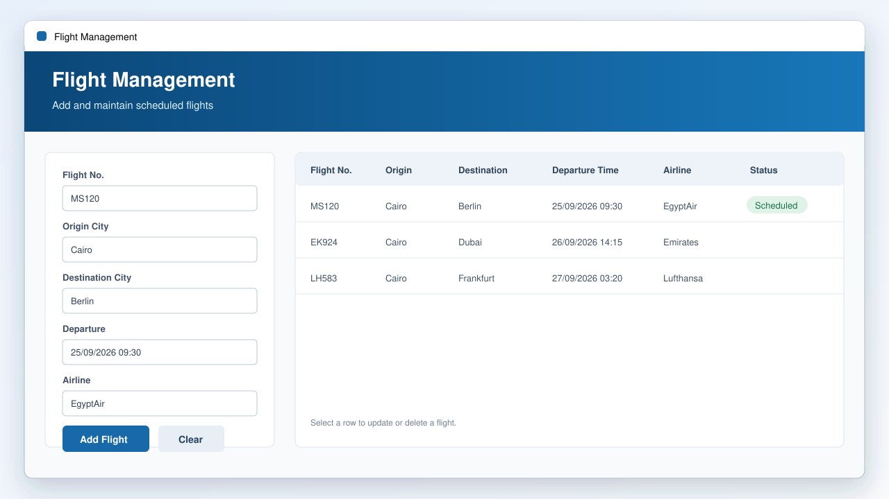
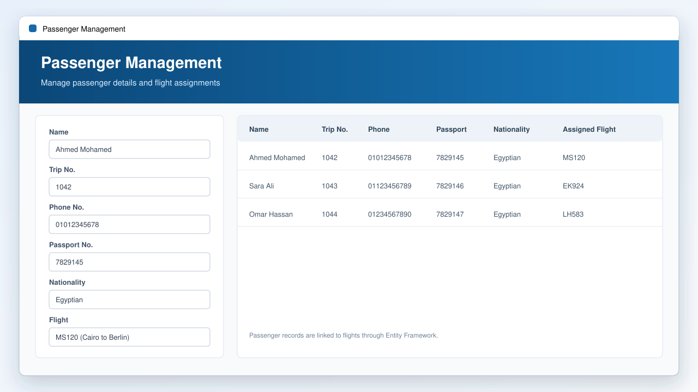
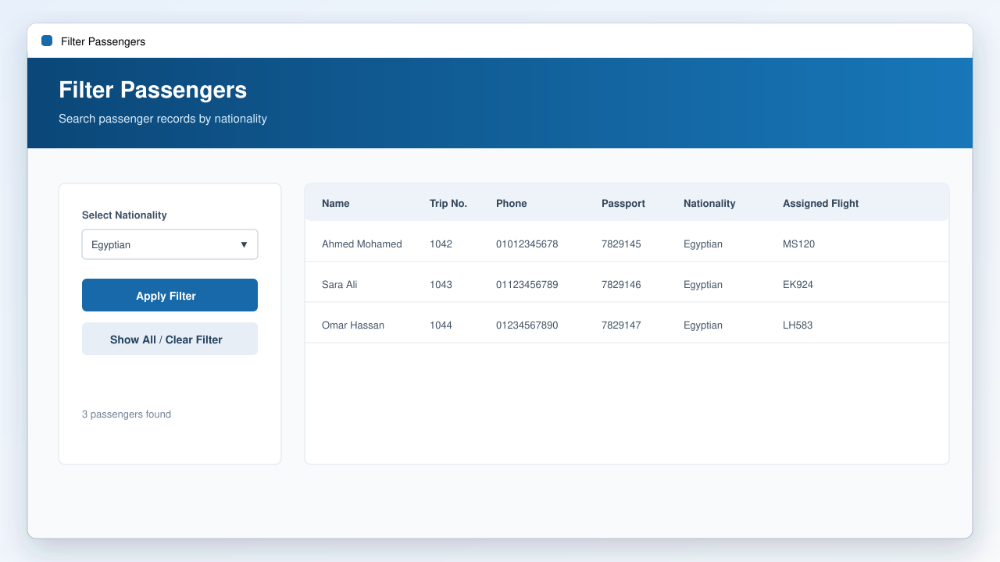
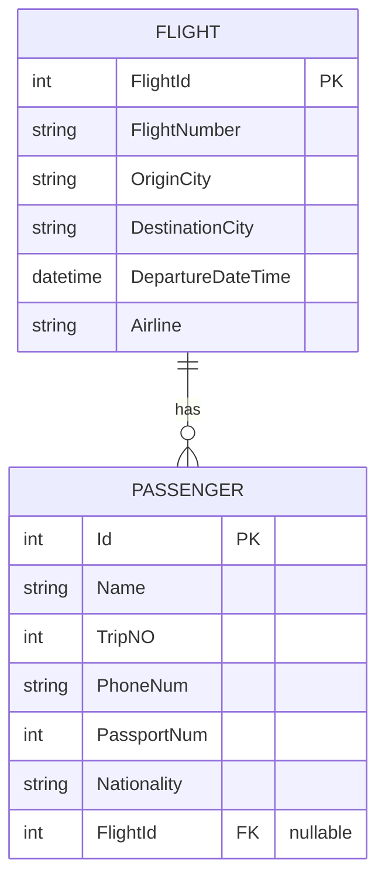
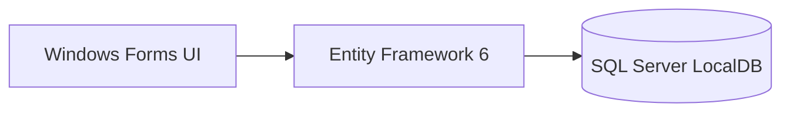

# Airline Reservation System

[](https://learn.microsoft.com/dotnet/desktop/winforms/)


A Windows Forms desktop application for managing airline flights and passengers. The project was created as a college application and demonstrates CRUD operations, input validation, filtering, Entity Framework relationships, and a SQL Server LocalDB database.

## Application Preview

> These UI previews are based on the project's Windows Forms Designer layouts and use sample data for presentation. Run the project on Windows to interact with the actual application.

### Main Menu



### Flight Management



### Passenger Management



### Filter Passengers



## Features

- Add, update, list, and delete flights.
- Add, update, list, and delete passengers.
- Assign passengers to flights.
- Prevent deleting flights that still have assigned passengers.
- Filter passengers by nationality.
- View all passengers assigned to a selected flight.
- Validate flight, passenger, phone, and passport data.
- Display a simple About screen.

## Technologies

- C#
- Windows Forms
- .NET Framework 4.7.2
- Entity Framework 6.5.1
- SQL Server Express LocalDB
- Visual Studio 2022

## Project Structure

```text
AirlineManagementApp/
├── Models/
│   ├── Flight.cs
│   └── Passenger.cs
├── Properties/
│   └── AssemblyInfo.cs
├── docs/
│   ├── screenshots/
│   │   ├── filter-passengers.png
│   │   ├── flight-management.png
│   │   ├── main-menu.png
│   │   └── passenger-management.png
│   └── PROJECT_REVIEW.md
├── AboutForm.*
├── FilteringForm.*
├── FlightForm.*
├── MainForm.*
├── PassengerForm.*
├── ViewPassengersByFlightForm.*
├── ApplicationDbContext.cs
├── Program.cs
├── App.config
├── packages.config
├── AirlineManagementApp.csproj
└── AirlineManagementApp.sln
```

## Database Model

- A `Flight` can have many passengers.
- A `Passenger` can be assigned to one flight.
- The passenger-to-flight relationship is optional, so a passenger can exist before a flight is selected.



## Architecture

The application follows a straightforward desktop architecture suitable for a small college project:



- Forms handle user input, validation, and screen navigation.
- Entity Framework maps the C# models to the LocalDB database.
- `ApplicationDbContext` provides the shared data-access entry point.

## Requirements

Install the following before running the project:

- Windows 10 or later
- Visual Studio 2022
- The **.NET desktop development** workload
- .NET Framework 4.7.2 targeting pack
- SQL Server Express LocalDB

## Getting Started

1. Clone or download the repository.
2. Open `AirlineManagementApp.sln` in Visual Studio.
3. Right-click the solution and choose **Restore NuGet Packages**.
4. Build the solution using **Build > Build Solution**.
5. Press `F5` to run the application.

The application uses this LocalDB connection from `App.config`:

```text
Data Source=(LocalDB)\MSSQLLocalDB;Initial Catalog=AirlineDatabase;Integrated Security=True;MultipleActiveResultSets=True
```

Entity Framework creates `AirlineDatabase` automatically the first time the application accesses it if the database does not already exist.

## Main Screens

- **Main Form:** Navigation to the application features.
- **Flights:** Flight management and validation.
- **Passengers:** Passenger management and flight assignment.
- **Filter Data:** Passenger filtering by nationality.
- **Passengers by Flight:** Passenger lookup for a selected flight.
- **About:** Basic application information.

## Suggested Git Workflow

- `main`: stable project version.
- `develop`: integration branch for ongoing work.
- `feature/passenger-management`: passenger-related improvements.
- `feature/flight-management`: flight-related improvements.
- `feature/filtering-and-reports`: filtering and reporting improvements.
- `docs/readme`: documentation updates.

Create future feature branches from `develop`, then merge them back through pull requests.

## Future Improvements

- Add login and role-based access.
- Add automated tests for validation and data access.
- Add flight search by date, origin, and destination.
- Add booking and ticket management.
- Export passenger and flight reports.
- Move database access into a separate service layer.
